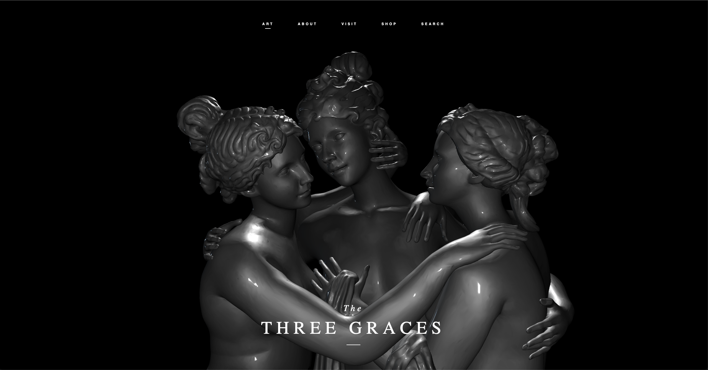

# Sveltekit [svelte-cubed](https://svelte-cubed.vercel.app/) Three Graces Design Study

This is a recreation of the Three Graces Projects by [drcmda](https://github.com/drcmda/testlighting) and [Anderson Mancini](https://github.com/ektogamat/threejs-graces). My goal was to recreate the original Three Graces by drcmda in Svelte as close as possible. I hope you enjoy!

Here is a screenshot of the app:
<p align="center">
    
</p>

## Getting started

Clone this repo and cd into the directory. After that install the dependencies with `npm install`. Then run `npm run dev` to start the development server.

```bash
# create a new project in the current directory
npm install 

# create a new project in my-app
npm run dev
```

# Attribution
Original design created by Tom Bogner @dastom on Dribble: https://dribbble.com/shots/6767548-The-Three-Graces-Concept

The GLTF used in this example was made by 3DLadnik: https://sketchfab.com/3DLadnik

Released as CC-BY-4.0 by Sketchfab: https://sketchfab.com/3d-models/3d-printable-the-three-graces-58e0ae19e2984b86883edc41bf43415a